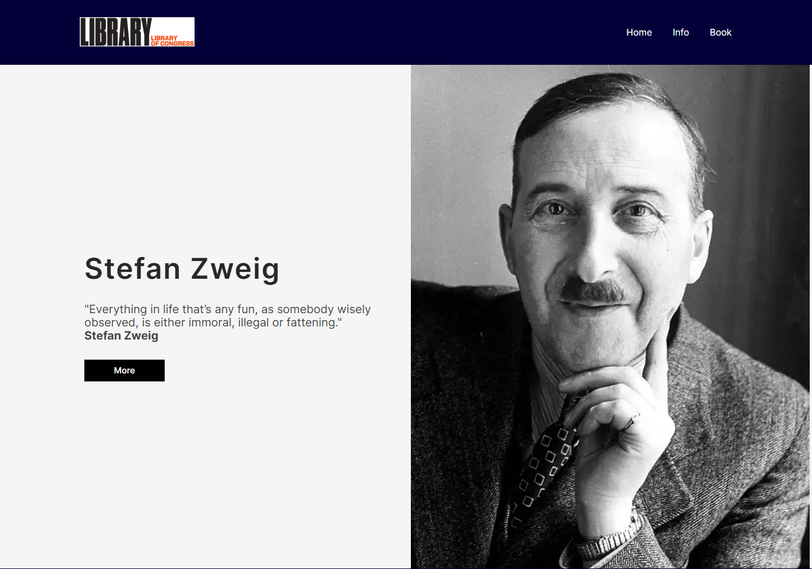
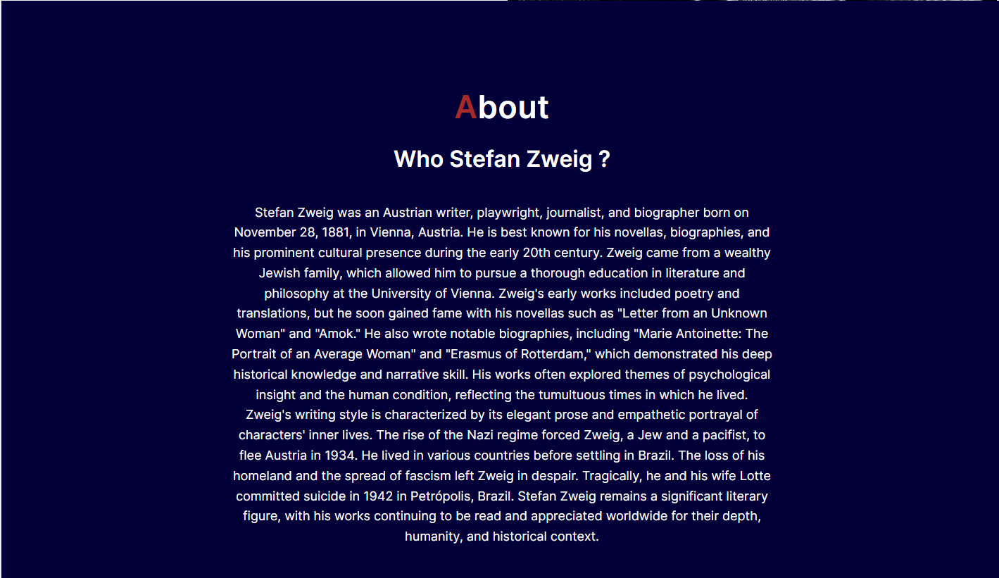
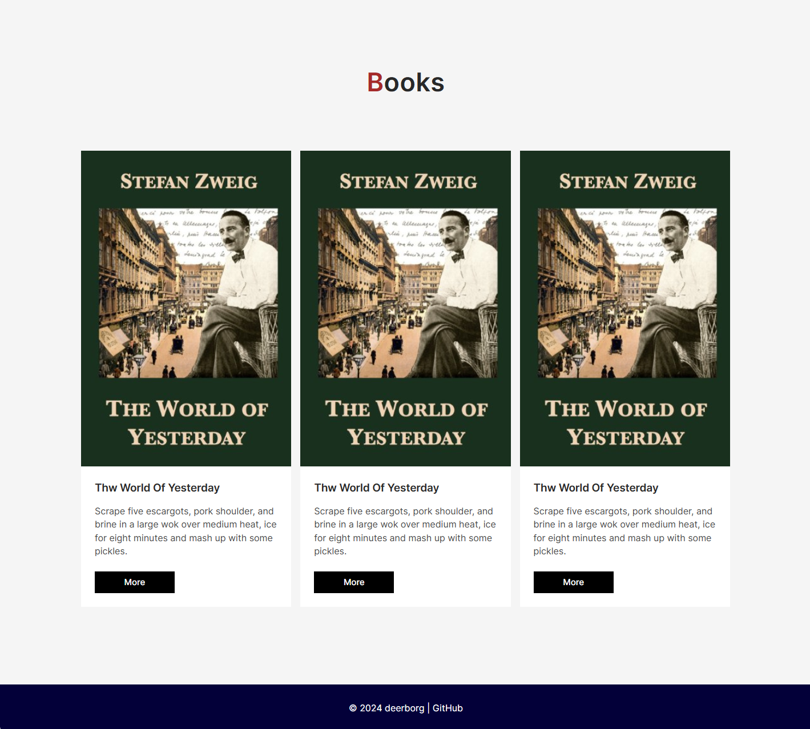

# Simple Blog Website

This project is a simple example of a blog website created using HTML and CSS.

## Images

## Introduction

This project demonstrates the basic structure and design of a blog website. It includes multiple pages such as homepage, about page, and individual blog post pages.

## Technologies Used

The project utilizes the following technologies:
- HTML
- CSS
    - Custom styles (style.css)
- JavaScript (optional, for interactive features)

## Features

- **Homepage**: Displays a list of latest blog posts.
- **About Page**: Provides information about the blog and its creators.
- **Blog Posts**: Individual pages for each blog post with content and comments.

## Installation

To clone the project to your local machine, use the following command:

Open the `index.html` file in your web browser to view the website.

## Usage

Navigate through the website using the menu links to explore different pages and blog posts.

## License

This project is licensed under the MIT License - see the [LICENSE](LICENSE) file for details.
