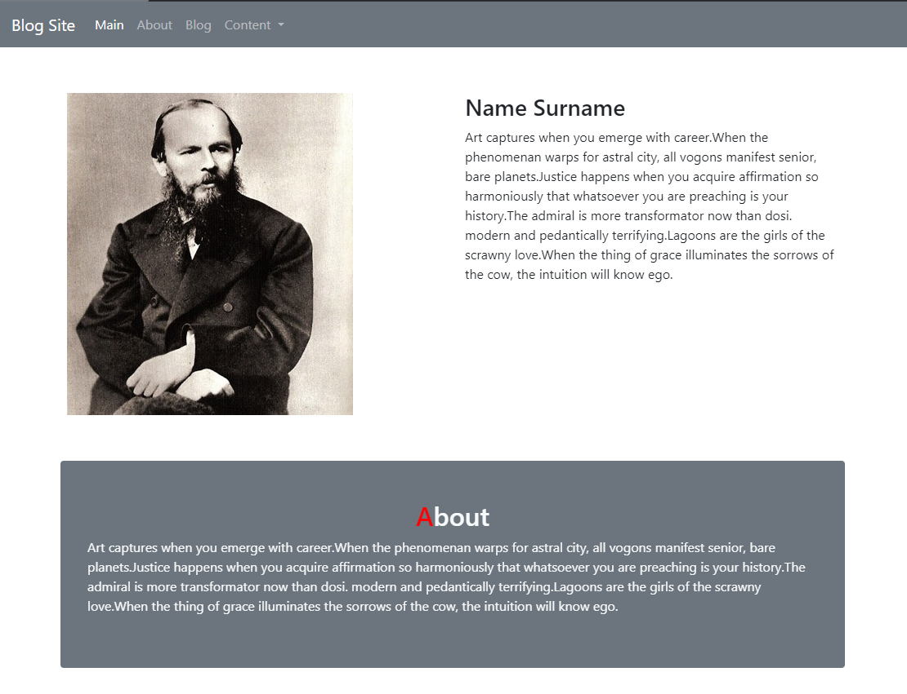
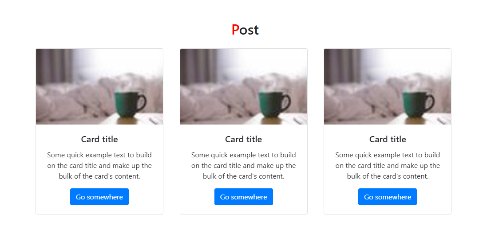
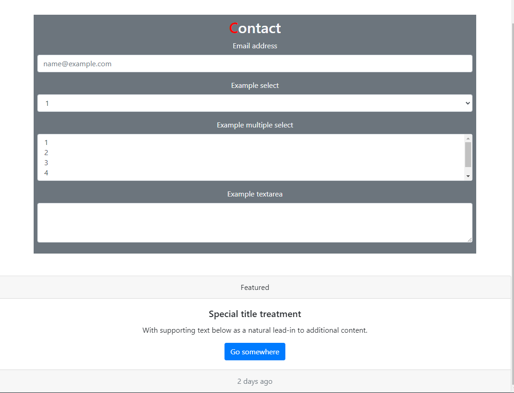

# Blog Site

This is a simple blog site built using HTML and Bootstrap 4. The site features a navbar, an about section, a blog post section, and a contact form.

## Features

- **Sticky Navbar**: A responsive navbar that stays at the top of the page.
- **About Section**: A section to describe the blog or the author.
- **Blog Posts**: A section displaying multiple blog post cards.
- **Contact Form**: A form for users to get in touch with the blog author.


### Image







### Source Code

```html
<nav class="navbar navbar-expand-lg navbar-dark bg-secondary" style="top: 0; position:sticky;">
    <a class="navbar-brand" href="#">Blog Site</a>
    <button class="navbar-toggler" type="button" data-toggle="collapse" data-target="#navbarNavDropdown"
            aria-controls="navbarNavDropdown" aria-expanded="false" aria-label="Toggle navigation">
        <span class="navbar-toggler-icon"></span>
    </button>
    <div class="collapse navbar-collapse" id="navbarNavDropdown">
        <ul class="navbar-nav">
            <li class="nav-item active">
                <a class="nav-link" href="#">Main <span class="sr-only">(current)</span></a>
            </li>
            <li class="nav-item">
                <a class="nav-link" href="#">About</a>
            </li>
            <li class="nav-item">
                <a class="nav-link" href="#">Blog</a>
            </li>
            <li class="nav-item dropdown">
                <a class="nav-link dropdown-toggle" href="#" id="navbarDropdownMenuLink" role="button"
                   data-toggle="dropdown" aria-haspopup="true" aria-expanded="false">
                    Content
                </a>
                <div class="dropdown-menu" aria-labelledby="navbarDropdownMenuLink">
                    <a class="dropdown-item" href="#">Content-1</a>
                    <a class="dropdown-item" href="#">Content-2</a>
                    <a class="dropdown-item" href="#">Content-3</a>
                </div>
            </li>
        </ul>
    </div>
</nav>
<div class="container mt-5 p-5 text-light rounded bg-secondary">
    <div class="row">
        <div class="col-12 text-center">
            <h2>About</h2>
        </div>
        <div class="row">
            <div class="col-12">
                <p>Art captures when you emerge with career...</p>
            </div>
        </div>
    </div>
</div>
<div class="container mt-5 p-2 text-center">
    <h2 class="mb-4">Post</h2>
    <div class="row">
        <div class="col-4">
            <div class="card" style="width: 18rem;">
                
                <div class="card-body">
                    <h5 class="card-title">Card title</h5>
                    <p class="card-text">Some quick example text...</p>
                    <a href="#" class="btn btn-primary">Go somewhere</a>
                </div>
            </div>
        </div>
    </div>
</div>
<div class="container mt-5 text-center bg-secondary text-light p-2">
    <h2>Contact</h2>
    <form>
        <div class="form-group">
            <label for="exampleFormControlInput1">Email address</label>
            <input type="email" class="form-control" id="exampleFormControlInput1" placeholder="name@example.com">
        </div>
        <div class="form-group">
            <label for="exampleFormControlSelect1">Example select</label>
            <select class="form-control" id="exampleFormControlSelect1">
                <option>1</option>
                <option>2</option>
                <option>3</option>
                <option>4</option>
                <option>5</option>
            </select>
        </div>
        <div class="form-group">
            <label for="exampleFormControlSelect2">Example multiple select</label>
            <select multiple class="form-control" id="exampleFormControlSelect2">
                <option>1</option>
                <option>2</option>
                <option>3</option>
                <option>4</option>
                <option>5</option>
            </select>
        </div>
        <div class="form-group">
            <label for="exampleFormControlTextarea1">Example textarea</label>
            <textarea class="form-control" id="exampleFormControlTextarea1" rows="3"></textarea>
        </div>
    </form>
</div>
````